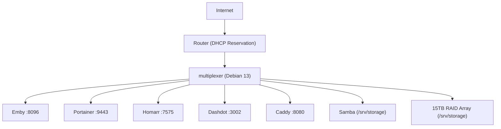

# 🚀 Lil Bestie Server Manual  
### USS Lil Bestie – Commissioned Infrastructure Platform

> Hostname: `multiplexer`  
> OS: Debian 13 (Trixie)  
> Role: Media • Web • File • Container Host  
> Status: Operational  

---

# 🖥 Overview

Lil Bestie began life as a Windows 10 machine that could no longer receive updates due to hardware limitations.  

It has since been rebuilt from bare metal into a stable Debian-based infrastructure platform running Dockerized services, network file sharing, a dashboard control plane, and automated backup strategy.

---

# 🛰 Architecture

# 🧠 Core Systems

## 🐳 Docker

Container runtime for all application services.

`docker ps`
`systemctl status docker`

## 🎬 Emby (Media Server)

Port: 8096

Media Root: /srv/storage/media

Status: Operational

## 🛠 Portainer (Container Management)

Port: 9443

SSL enabled

Used for container lifecycle management

## 🖥 Homarr (Dashboard)

Port: 7575

Centralized service control interface

Contains Captain’s Log and telemetry

## 📊 Dashdot (System Telemetry)

Port: 3002

Host metrics mounted read-only

Real-time CPU, memory, disk, network

## 🌐 Caddy (Web Server)

Port: 8080

Hosts personal site

Static content served from /srv/storage/www

## 📂 Samba (File Sharing)

Network Share: \\192.168.x.x\Media

Mounted locally at /srv/storage/media

Windows Z: drive mapping configured

## 💾 Storage Layout

NVMe SSD: Operating System

15TB RAID: Primary Data (/srv/storage)

8TB HDD: Backup Target (offline strategy in progress)

Mount validation:

`df -h | grep storage`

## 🔁 Backup Strategy

Critical assets:

Photos

Recipes

Minecraft Worlds

Website content

Strategy:

Primary: RAID

Secondary: 8TB backup disk

rsync-based nightly backups

Docker volume snapshotting

## 🚨 Post-Reboot Checklist
`uname -r`
`df -h | grep storage`
`docker ps`

If all pass → vessel stable.

## 🛠 Lessons Learned

Kernel regressions happen.

systemd mount options matter.

A single misplaced dash can cost hours.

DHCP reservations prevent existential dread.

Monitoring dashboards can lie.

Documentation reduces future chaos.

Cookies improve uptime.

## 🏁 Commissioning Statement

Lil Bestie has been successfully converted from a defunct Windows 10 machine into a stable Debian-based infrastructure host supporting:

Media streaming

Container orchestration

Network file sharing

Personal web hosting

Real-time telemetry

Dashboard control plane

Structured backup strategy

Deployed and stabilized by Michelle.

Breaker of Kernels.
Mapper of Z Drives.
All romance containerized.
